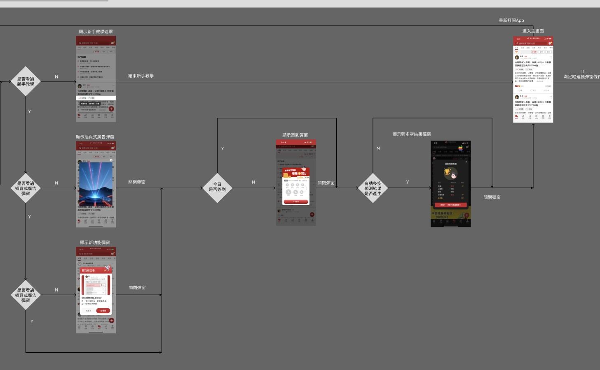
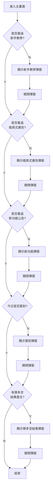

# Topic 2：彈窗連鎖顯示機制 (Popup Response Chain)

## 原始流程圖

---

## 情境描述

當用戶重新打開 App 並進入主畫面後，系統需要依照**優先順序**檢查各種彈窗的顯示條件。

**規則如下**：
- 同一時間只會顯示一個彈窗
- 用戶關閉當前彈窗後，系統繼續檢查下一個彈窗是否符合顯示條件
- 若所有條件都不符合，則不顯示任何彈窗

---

## 流程圖

---

## 彈窗優先順序與條件

| 順序 | 彈窗類型 | 顯示條件 |
|:----:|----------|----------|
| 1 | 新手教學 (Tutorial) | 用戶尚未看過新手教學 |
| 2 | 插頁式廣告 (Interstitial Ad) | 用戶尚未看過此廣告 |
| 3 | 新功能公告 (New Feature) | 用戶尚未看過新功能公告 |
| 4 | 每日簽到 (Daily Check-in) | 用戶今日尚未簽到 |
| 5 | 猜多空結果 (Prediction Result) | 有預測結果產生 |

---

## 設計要求

請使用 **Chain of Responsibility** 設計模式，設計一個可擴展的彈窗連鎖顯示系統：

1. **定義 Protocol**：設計一個彈窗處理器的介面，包含檢查條件與處理邏輯的方法，以及指向下一個處理器的屬性

2. **實作各種 Handler**：為每種彈窗類型實作獨立的處理器，各自負責判斷自身的顯示條件

3. **串接 Handler Chain**：透過 next 屬性將所有處理器依優先順序串接起來

4. **建立 Manager**：實作一個管理器負責組裝 chain，並提供對外的方法來啟動檢查流程

5. **可擴展性**：設計需能輕易新增或移除彈窗類型，不需大幅修改現有程式碼

---
