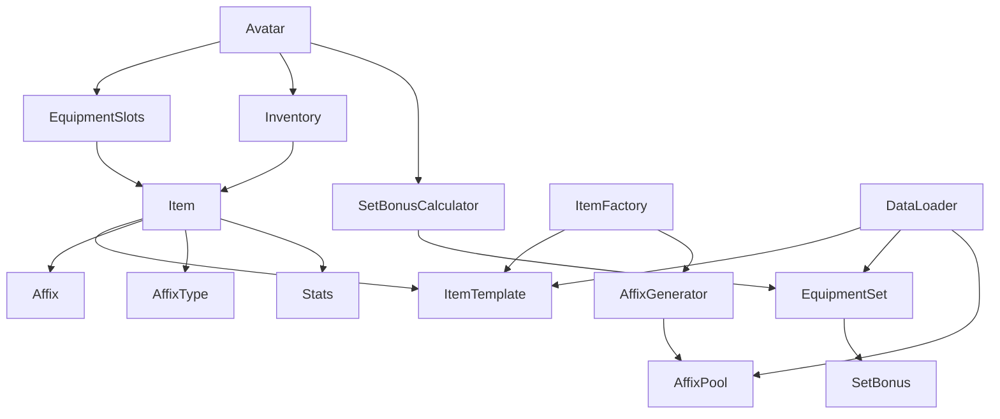

# Implementation Plan: RPG 物品/背包系統

**Branch**: `004-rpg-inventory-system` | **Date**: 2026-02-01 | **Spec**: [spec.md](spec.md)
**Input**: Feature specification from `specs/004-rpg-inventory-system/spec.md`

## Summary

實作一套完整的 RPG 遊戲裝備道具系統，包含物品模板與實例、詞條系統（使用 Bitmask）、套裝效果、裝備欄與背包管理。系統需支援 JSON 序列化以利資料持久化。

## Technical Context

**Language/Version**: Swift 5.9+
**Primary Dependencies**: Foundation (UUID, Codable)
**Storage**: JSON 檔案（可擴展至 CoreData）
**Testing**: XCTest
**Target Platform**: iOS 15+ / macOS 12+
**Project Type**: Single project (library module)
**Performance Goals**: 
- Bitmask 查詢 O(1)
- 背包操作 O(n)
- 數值計算即時（< 1ms）

**Constraints**: 
- 純 Swift 實作，不依賴第三方套件
- 值類型優先（struct），僅必要時使用 class
- 完整的 Codable 支援

## Constitution Check

| Principle | Status | Notes |
|-----------|--------|-------|
| 程式碼品質 | ✅ PASS | 使用 SOLID 原則、Protocol-Oriented Design |
| 可測試性 | ✅ PASS | 所有核心邏輯可單元測試 |
| 可維護性 | ✅ PASS | 清晰的分層架構 |
| 效能 | ✅ PASS | Bitmask 實現 O(1) 查詢 |

## Project Structure

### Documentation (this feature)

```text
specs/004-rpg-inventory-system/
├── spec.md              # 功能規格
├── plan.md              # 實作計劃（本文件）
├── research.md          # 技術研究
├── data-model.md        # 資料模型設計
├── quickstart.md        # 快速開始指南
├── contracts/           # API 合約
│   └── item-protocol.swift
├── checklists/          # 檢查清單
│   └── requirements.md
└── tasks.md             # 任務分解
```

### Source Code

```text
src/
├── Core/
│   ├── Enums.swift              # EquipmentSlot, Rarity, ElementType
│   ├── Stats.swift              # Stats 結構與運算
│   └── Errors.swift             # 錯誤定義
├── Models/
│   ├── AffixType.swift          # Bitmask 詞條類型
│   ├── Affix.swift              # 詞條與詞條池
│   ├── ItemTemplate.swift       # 物品模板
│   ├── Item.swift               # 物品實例
│   ├── ItemAttribute.swift      # 物品屬性
│   └── EquipmentSet.swift       # 套裝定義
├── Generators/
│   └── AffixGenerator.swift     # 詞條隨機生成
├── Calculators/
│   └── SetBonusCalculator.swift # 套裝效果計算
├── Containers/
│   ├── EquipmentSlots.swift     # 裝備欄
│   ├── Inventory.swift          # 背包
│   └── Avatar.swift             # 角色
└── Services/
    ├── ItemFactory.swift        # 物品工廠
    └── DataLoader.swift         # JSON 載入器

tests/
├── BasicTests.swift             # 基礎功能測試
├── AffixTests.swift             # 詞條系統測試
├── SetBonusTests.swift          # 套裝系統測試
└── IntegrationTests.swift       # 整合測試

resources/
├── item_templates.json          # 物品模板資料
├── equipment_sets.json          # 套裝定義
└── affix_pools.json             # 詞條池配置
```

## Architecture Overview

```
┌─────────────────────────────────────────────────────────────┐
│                        Avatar (角色)                         │
├─────────────────────────────────────────────────────────────┤
│  ┌───────────────────┐    ┌──────────────────────────────┐ │
│  │  EquipmentSlots   │    │         Inventory            │ │
│  │  (裝備欄)          │    │         (背包)               │ │
│  │  ├─ helmet        │    │  ├─ Item[]                   │ │
│  │  ├─ body          │    │  ├─ capacity                 │ │
│  │  ├─ gloves        │◄──►│  ├─ filter(by:)             │ │
│  │  ├─ boots         │    │  └─ sort(by:)               │ │
│  │  └─ belt          │    └──────────────────────────────┘ │
│  └───────────────────┘                                      │
└─────────────────────────────────────────────────────────────┘
                              │
                              ▼
┌─────────────────────────────────────────────────────────────┐
│                     Item (物品實例)                          │
├─────────────────────────────────────────────────────────────┤
│  instanceId: UUID          ◄── 唯一識別碼                    │
│  templateId: String        ◄── 參照模板                      │
│  slot: EquipmentSlot       ◄── 裝備欄位                      │
│  rarity: Rarity            ◄── 稀有度                        │
│  level: Int                ◄── 當前等級                      │
│  baseStats: Stats          ◄── 基礎數值                      │
│  mainAffix: Affix          ◄── 主詞條                        │
│  subAffixes: [Affix]       ◄── 副詞條 (0-4條)               │
│  affixMask: AffixType      ◄── Bitmask 快速查詢             │
│  setId: String?            ◄── 套裝 ID                       │
└─────────────────────────────────────────────────────────────┘
                              │
                              ▼
┌─────────────────────────────────────────────────────────────┐
│                   AffixType (Bitmask)                       │
├─────────────────────────────────────────────────────────────┤
│  struct AffixType: OptionSet {                              │
│      static let crit           = 0b0000_0001                │
│      static let energyRecharge = 0b0000_0010                │
│      static let attack         = 0b0000_0100                │
│      static let defense        = 0b0000_1000                │
│      static let hp             = 0b0001_0000                │
│      ...                                                     │
│  }                                                           │
│  ─────────────────────────────────────────────────────────  │
│  contains(_:)     → O(1) 單一詞條檢查                        │
│  contains([])     → O(1) 多詞條同時檢查                      │
│  isDisjoint(with:)→ O(1) 任一詞條檢查                        │
└─────────────────────────────────────────────────────────────┘
```

## Implementation Phases

### Phase 1: Core Data Models (P1)

1. 實作 `EquipmentSlot` 枚舉 (5 個欄位)
2. 實作 `Rarity` 枚舉 (5 種稀有度，含副詞條數量邏輯)
3. 實作 `Stats` 結構 (7 種數值 + 運算子重載)
4. 實作 `StatKey` 枚舉 (動態數值存取)
5. 實作 `ElementType` 和 `SpecialEffectType` 枚舉

### Phase 2: Affix System (P1-P2)

1. 實作 `AffixType` (OptionSet Bitmask)
2. 實作 `Affix` 結構 (詞條資料)
3. 實作 `AffixPoolEntry` 和 `AffixPool` (詞條池)
4. 實作 `AffixGenerator` (權重隨機生成)

### Phase 3: Item System (P1)

1. 實作 `ItemAttribute` (物品屬性：數值/元素/特殊)
2. 實作 `ItemTemplate` (物品模板)
3. 實作 `Item` 類別 (物品實例，含 Bitmask 管理)
4. 實作 `ItemFactory` (從模板生成物品)

### Phase 4: Set Bonus System (P2)

1. 實作 `SetBonusEffect` (套裝效果)
2. 實作 `SetBonus` (套裝加成定義)
3. 實作 `EquipmentSet` (套裝)
4. 實作 `SetBonusCalculator` (套裝效果計算)

### Phase 5: Container System (P1-P2)

1. 實作 `EquipmentError` 和 `InventoryError`
2. 實作 `EquipmentSlots` (裝備欄管理)
3. 實作 `Inventory` (背包管理)
4. 實作 `Avatar` (角色整合)

### Phase 6: Services & Serialization (P3)

1. 實作 `DataLoader` (JSON 載入/序列化)
2. 建立 JSON 資源檔案
3. 實作完整的 Codable 支援

### Phase 7: Testing (All Phases)

1. 基礎功能測試 (4 個測試案例)
2. 詞條系統測試 (4 個測試案例)
3. 套裝系統測試 (3 個測試案例)
4. 整合測試

## Complexity Tracking

| Component | Estimated LOC | Complexity | Risk |
|-----------|---------------|------------|------|
| Core/Enums | ~120 | Low | Low |
| Core/Stats | ~80 | Low | Low |
| Models/AffixType | ~150 | Medium | Low |
| Models/Affix | ~100 | Low | Low |
| Models/Item | ~200 | Medium | Medium |
| Models/EquipmentSet | ~100 | Low | Low |
| Generators/AffixGenerator | ~150 | Medium | Medium |
| Calculators/SetBonusCalculator | ~120 | Medium | Low |
| Containers/EquipmentSlots | ~120 | Low | Low |
| Containers/Inventory | ~180 | Low | Low |
| Containers/Avatar | ~150 | Medium | Low |
| Services/DataLoader | ~150 | Medium | Medium |
| Tests | ~400 | Low | Low |
| **Total** | **~2000** | **Medium** | **Low** |

## Dependencies



## Testing Strategy

| Test Type | Coverage Target | Framework |
|-----------|-----------------|-----------|
| Unit Tests | 90%+ | XCTest |
| Integration Tests | Core flows | XCTest |
| Property-based Tests | Bitmask operations | - |

## Risk Mitigation

| Risk | Likelihood | Impact | Mitigation |
|------|------------|--------|------------|
| Bitmask 邏輯錯誤 | Low | High | 完整的 Bitmask 單元測試 |
| 數值計算精度問題 | Low | Medium | 使用 Double，測試邊界值 |
| JSON 序列化不相容 | Medium | Medium | 定義明確的 schema，版本控制 |
| 套裝效果計算複雜度 | Low | Low | 預計算套裝映射 |
