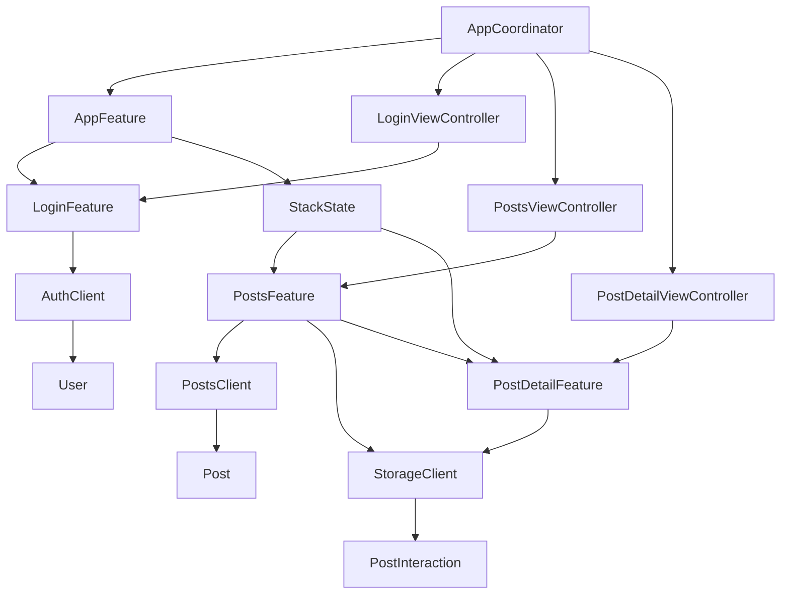

# Implementation Plan: TCA + UIKit 整合實戰

**Branch**: `feature/monster5-tca-uikit-integration` | **Date**: 2026-02-17 | **Spec**: [spec.md](spec.md)
**Input**: Feature specification from `specs/005-tca-uikit-integration/spec.md`

## Summary

使用 The Composable Architecture (TCA) 1.7+ 與 UIKit 實作登入頁面、文章列表頁面、文章詳情頁面，包含真實 API 請求、狀態同步、Local Storage 持久化。所有導航由 TCA State 驅動，使用 `observe { }` 模式整合 UIKit。

## Technical Context

**Language/Version**: Swift 5.9+
**Primary Dependencies**: 
- The Composable Architecture (TCA) 1.7+
- UIKit
- Foundation (URLSession, JSONEncoder/Decoder, UserDefaults)
**Testing**: XCTest + TCA TestStore
**Target Platform**: iOS 16+
**Project Type**: iOS App (UIKit-based)

**APIs**:
- Login: `POST https://dummyjson.com/auth/login`
- Posts: `GET https://jsonplaceholder.typicode.com/posts`

**Constraints**:
- 使用 UIKit 建構所有 UI（非 SwiftUI）
- 使用 TCA `observe { }` 模式（非舊版 ViewStore）
- 導航由 TCA State 驅動
- 所有副作用透過 Dependency 注入

## Constitution Check

| Principle | Status | Notes |
|-----------|--------|-------|
| 程式碼品質 | ✅ PASS | TCA 架構強制單向資料流 |
| 可測試性 | ✅ PASS | Dependency 注入 + TestStore |
| 可維護性 | ✅ PASS | Feature 模組化分離 |
| 效能 | ✅ PASS | observe 自動追蹤最小更新範圍 |

## Project Structure

### Documentation (this feature)

```text
specs/005-tca-uikit-integration/
├── spec.md              # 功能規格
├── plan.md              # 實作計劃（本文件）
├── research.md          # 技術研究
├── data-model.md        # 資料模型設計
├── quickstart.md        # 快速開始指南
├── contracts/           # API 合約
│   ├── auth-client.swift
│   ├── posts-client.swift
│   └── storage-client.swift
├── checklists/          # 檢查清單
│   └── requirements.md
└── tasks.md             # 任務分解
```

### Source Code

```text
Monster5/
├── App/
│   ├── AppFeature.swift           # App 層級 Reducer（導航管理）
│   ├── AppCoordinator.swift       # UIKit 導航協調器（UINavigationController）
│   └── SceneDelegate.swift        # App 入口，建立初始 Store
├── Features/
│   ├── Login/
│   │   ├── LoginFeature.swift     # Login Reducer（State, Action, body）
│   │   └── LoginViewController.swift  # Login UI（UIKit + observe）
│   ├── Posts/
│   │   ├── PostsFeature.swift     # Posts List Reducer
│   │   ├── PostsViewController.swift  # Posts List UI（UITableView）
│   │   └── PostTableViewCell.swift    # Custom UITableViewCell
│   └── PostDetail/
│       ├── PostDetailFeature.swift    # Post Detail Reducer
│       └── PostDetailViewController.swift # Post Detail UI
├── Dependencies/
│   ├── AuthClient.swift           # 登入 API Dependency
│   ├── PostsClient.swift          # 文章 API Dependency
│   └── StorageClient.swift        # Local Storage Dependency
├── Models/
│   ├── User.swift                 # 用戶資料模型
│   ├── Post.swift                 # 文章資料模型
│   ├── PostInteraction.swift      # 互動數據模型
│   ├── Comment.swift              # 留言模型
│   └── APIError.swift             # API 錯誤模型
└── Views/
    └── ToastView.swift            # 自訂 Error Toast View
```

## Architecture Overview

```
┌─────────────────────────────────────────────────────────────────┐
│                    AppFeature (Root Reducer)                     │
│  ┌───────────────┐    ┌──────────────────────────────────────┐ │
│  │ LoginFeature  │    │  StackState<Path>                    │ │
│  │ (login state) │    │  ├─ .posts(PostsFeature.State)       │ │
│  │               │    │  └─ .postDetail(PostDetailFeature)   │ │
│  └───────┬───────┘    └──────────────────────────────────────┘ │
│          │                                                       │
│          │ login success → push .posts                           │
│          │ tap cell → push .postDetail                           │
└─────────────────────────────────────────────────────────────────┘
                              │
            ┌─────────────────┼─────────────────┐
            ▼                 ▼                 ▼
     ┌─────────────┐  ┌─────────────┐  ┌──────────────┐
     │ AuthClient  │  │ PostsClient │  │StorageClient │
     │ (API)       │  │ (API)       │  │ (UserDefaults)│
     └─────────────┘  └─────────────┘  └──────────────┘
```

### 資料流（單向）

```
User Action → store.send(Action) → Reducer → State 更新 → observe { } → UI 更新
                                     │
                                     ├─ Effect.run { } → API 呼叫 → send(Response Action)
                                     └─ Effect.run { } → Storage 讀寫
```

## Implementation Phases

### Phase 1: Models & Dependencies (P1)

1. 定義 `User`、`Post`、`PostInteraction`、`Comment`、`APIError` 模型
2. 實作 `AuthClient` Dependency（liveValue + testValue）
3. 實作 `PostsClient` Dependency（liveValue + testValue）
4. 實作 `StorageClient` Dependency（liveValue + testValue）

### Phase 2: Login Feature (P1)

1. 實作 `LoginFeature` Reducer（State, Action, body）
2. 實作 `LoginViewController`（UIKit + observe）
3. 實作 Error Toast UI
4. 撰寫 LoginFeature 單元測試

### Phase 3: Posts Feature (P1)

1. 實作 `PostsFeature` Reducer
2. 實作 `PostsViewController`（UITableView + observe）
3. 實作 `PostTableViewCell`（含按讚數、留言數、分享按鈕）
4. 撰寫 PostsFeature 單元測試

### Phase 4: PostDetail Feature (P1)

1. 實作 `PostDetailFeature` Reducer
2. 實作 `PostDetailViewController`（UIKit + observe）
3. 實作按讚 toggle 邏輯與 Storage 持久化
4. 撰寫 PostDetailFeature 單元測試

### Phase 5: Navigation & App Integration (P1)

1. 實作 `AppFeature` Reducer（Stack-based Navigation）
2. 實作 `AppCoordinator`（UINavigationController 與 TCA observe 綁定）
3. 設定 `SceneDelegate` 作為入口
4. 實作登入成功後的導航邏輯
5. 實作列表到詳情的 push/pop 邏輯

### Phase 6: State Sync & Storage (P1-P2)

1. 實作 PostDetail → PostsList 狀態同步
2. 實作 StorageClient 完整讀寫邏輯
3. 實作 App 啟動時載入互動數據
4. 撰寫整合測試

### Phase 7: Comments & Polish (P2)

1. 實作留言功能 UI 與 Reducer 邏輯
2. 留言數同步回列表頁
3. UI 細節調整

## Complexity Tracking

| Component | Estimated LOC | Complexity | Risk |
|-----------|---------------|------------|------|
| Models (5 files) | ~100 | Low | Low |
| AuthClient | ~60 | Low | Low |
| PostsClient | ~40 | Low | Low |
| StorageClient | ~80 | Medium | Low |
| LoginFeature | ~80 | Medium | Low |
| LoginViewController | ~120 | Medium | Medium |
| PostsFeature | ~100 | Medium | Medium |
| PostsViewController | ~180 | Medium | Medium |
| PostTableViewCell | ~80 | Low | Low |
| PostDetailFeature | ~80 | Medium | Low |
| PostDetailViewController | ~150 | Medium | Medium |
| AppFeature (Navigation) | ~100 | High | High |
| AppCoordinator | ~120 | High | High |
| ToastView | ~60 | Low | Low |
| Tests | ~300 | Medium | Low |
| **Total** | **~1650** | **Medium** | **Medium** |

## Dependencies



## Testing Strategy

| Test Type | Coverage Target | Framework |
|-----------|-----------------|-----------|
| LoginFeature Unit Tests | 90%+ | TCA TestStore |
| PostsFeature Unit Tests | 90%+ | TCA TestStore |
| PostDetailFeature Unit Tests | 90%+ | TCA TestStore |
| AppFeature Integration | Navigation flows | TCA TestStore |
| StorageClient Unit Tests | 100% | XCTest |

## Risk Mitigation

| Risk | Likelihood | Impact | Mitigation |
|------|------------|--------|------------|
| TCA + UIKit observe 整合複雜度 | Medium | High | 參考官方範例，先實作最簡 Feature |
| Stack-based Navigation 與 UIKit 不匹配 | Medium | High | 可降級為 Tree-based 或手動導航 |
| 狀態同步遺漏 | Low | Medium | 使用 IdentifiedArray 共享 State |
| API 回應格式不符預期 | Low | Low | 使用測試用 curl 預先驗證 |
| UserDefaults 資料損毀 | Low | Low | 提供 fallback 預設值，try/catch 解碼 |
